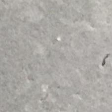
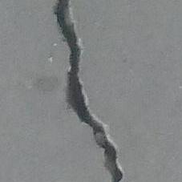
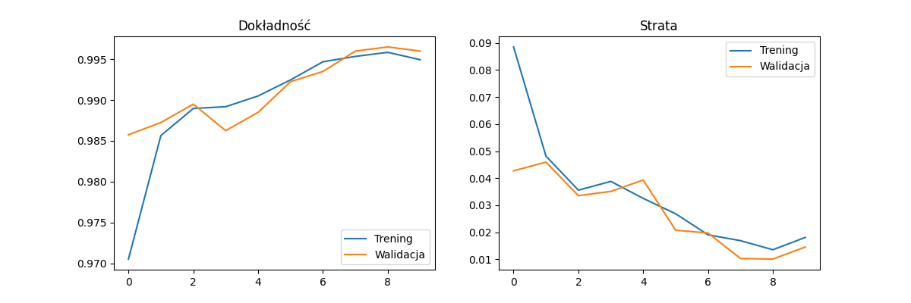
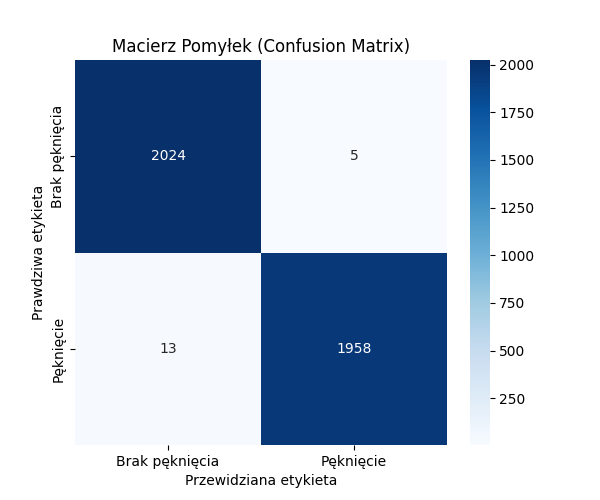

# Automated crack detection

An academic/engineering project focused on automated crack detection in industrial infrastructure (e.g., concrete surfaces) using deep learning.

## About the project
To solve the binary classification problem (crack vs. no crack), a Convolutional Neural Network (CNN) was built and trained using the **TensorFlow/Keras** library.

The dataset was split into three independent parts:
* **Training set (80%)** - used to train the model.
* **Validation set (10%)** - used to monitor the training process and prevent overfitting.
* **Test set (10%)** - used for the final, objective evaluation of the model's performance on completely unseen data.

## Dataset Samples
Here are examples of the images used in this project:

| No Crack (Negative) | Crack (Positive) |
|:---:|:---:|
|  |  |

## Technologies
* Python
* TensorFlow / Keras
* Matplotlib & Seaborn (Data Visualization)
* Scikit-learn (Evaluation Metrics)

## Model results
The model achieved outstanding accuracy on the test set. Below are the detailed metrics, training history, and the final confusion matrix.

### Evaluation Metrics
| Metric | No Crack (Negative) | Crack (Positive) |
|--------|---------------------|------------------|
| **Precision** | 0.99 | 1.00 |
| **Recall (Sensitivity)** | 1.00 | 0.99 |
| **F1-Score** | 1.00 | 1.00 |

**Overall Accuracy:** ~99.5% 
**Tested on:** 4000 images

### Training History (Accuracy and Loss)


### Confusion Matrix



## How to Run the Project locally
1. Clone this repository.
2. Download the dataset and place the images inside the `dataset/` folder (using `positive` and `negative` subfolders).
3. Install the required dependencies:
   ```bash
   pip install -r requirements.txt